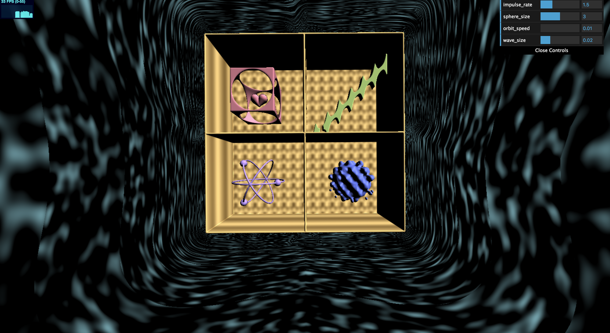
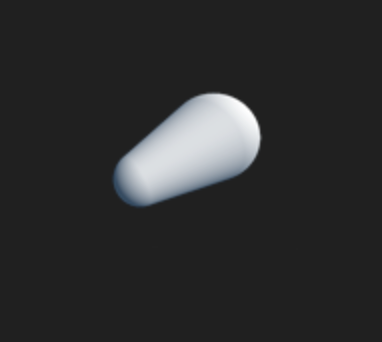

# CIS 566 Homework 2: Implicit Surfaces

## Programmer Information
- Name: Chianti Yan
- PennKey: 85100574

## Demo Page
This is the link to my github page: https://chiantiyzy.github.io/hw02-raymarching-sdfs/
When you open the link, you should see something like this:

## Project Explained
### Main Ideas
This project is to use SDF functions to generate interesting geometries and animated them. Noise functions and procedural rendering are also applied to texturing my background and geometries. To generated geomteries, we used ray marching on certain SDF functions predefined. The concept of ray marching is that you resample the distance between the surface and the ray step by step and eventually reach the surface. Many of interesting SDF functions could be found on IQ's blog. I also used **Bounding Volumne Hierarcy** on ray marching, which helped to optimize the calculation. The ray first reach the bounding box, and only march on SDF functions within the bounding box, so unrelated geometry won't be calculated and therefore saves time. I will then explain each of my geometries seperately. 

### Heart Impulse Within a Box
This geometry has 4 primitive SDF functions. First, the box is an substraction function on a round box and a sphere. Then I applies an smoothUnion function on two round cones and make them heart-like. The primitive geometries of the round cone looks like below:

After generating the heart geometry, I applied an **impulse** curve on this, so it can mimic the real impulse. 

### Bending Box to Simulate Wave 
The primitive geometry of this wave shape geometry is a flat box. I applied IQ's bending function on this so it could have curves. The curving rate is generated by a **smoothstep** function interpolated by x value with respective to u_Time. 

### Orbits and Balls 
This is a simple geometry created by union three torus and three spheres. The spheres are travelling on the orbit, which is a simple translation based on sin and cos functions. 

### Simultaneous Sphere Displacement 
The displacement function of the sphere could be founc on IQ's page. What I did is to relate it to u_Time such that it could keep on morphing. 

### Shelf and Textures
I used Perlin Noise functions for procedural texturing my shelf box. The shelf boards have noise functions related to z-axis such that it could mimix the wooden strip pattern. The back board of the shelf is a perlin noise function with repetition, so it could repeats a pattern. The backgroud is a simple perlin noise on the intersection points. 

### Surface Normal and Shading 
Surface normal is calculated using the gradient of the SDF function. It is then implemented to Blinn Phong and Lambert lights to make the shading effects. 

## Citation and Reference
- **Noise functions**
  The Perlin function algorithm is found online under this link:
  https://github.com/ashima/webgl-noise/blob/master/src/classicnoise3D.glsl

- **SDF Related Functions**
  All of the SDF functions are found on IQ's blog about distance functions. This is the link to the blog:
  http://iquilezles.org/www/articles/distfunctions/distfunctions.htm

- **Other Useful Pages**
  I also looked at Jamie Wong's blog for more detailed explaination about SDF transformation and normal calculating. The link is attached below:
  http://jamie-wong.com/2016/07/15/ray-marching-signed-distance-functions/

  